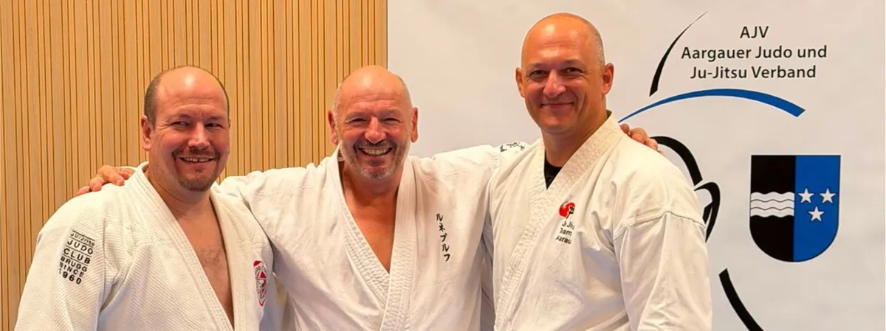

## Ein spannender Trainingstag voller Vielfalt und Energie

Am Samstag, 29. August 2026, fand von 9.00 bis 13.00 Uhr der zweite Aargauer Ju-Jitsu Day in Baden statt. Der Anlass wurde verdankenswerterweise vom Aargauer Judo und Ju-Jitsu Verband (AJV) gesponsert und brachte 13 Clubs aus den Sparten Ju-Jitsu, Judo und Karate zusammen. Insgesamt trainierten 50 passionierte Budokas im Dojo des Judo Club Baden-Wettingen.

Das Training war in drei abwechslungsreiche Einheiten aufgeteilt, in denen verschiedene Stilrichtungen und Schwerpunkte auf dem Programm standen. Besonders schön war die grosse Vielfalt der Teilnehmenden: Vom jungen Nachwuchs ab 12 Jahren bis hin zum ältesten Teilnehmer mit 64 Jahren war alles vertreten.

## Das Programm

- **David Wernli** widmete sich dem Thema **Gleichgewicht**. Mit verschiedenen Übungen wurde gezeigt, wie wichtig eine gute Balance und Körperkontrolle für eine saubere und effektive Technik sind.
- **Tom Meister** zeigte spannende Techniken rund um die **Stockabwehr**. Dabei ging es um eine realistische erste Reaktion, welche den Angriff stoppt. Die Teilnehmenden durften dann noch spielerische und dennoch effektive Abführ- und Kontrolltechniken mit dem Stock üben.
- **René Burch** brachte mit seinen **Atemi-Kombinationen** einen weiteren interessanten Aspekt ins Training ein. Die Übungen zeigten eindrücklich, wie Atmung, Bewegung, Spannung, Technik und zum Schluss auch wieder das Gleichgewicht miteinander verbunden werden können.

Ein grosses Dankeschön geht darum an unsere drei Senseis (Lehrer) David Wernli, Tom Meister und René Burch, die mit ihren interessanten und abwechslungsreichen Trainingseinheiten für einen lehrreichen Vormittag gesorgt haben.

## Ji Ta Kyo Ei – Austausch und gemeinsames Wachsen

Es war ein weiterer gelungener Aargauer Ju-Jitsu Day, bei welchem der Austausch und das gemeinsame Wachsen (Ji Ta Kyo Ei) im Vordergrund standen.

Ein herzliches Dankeschön an alle Trainierenden, die diesen Tag zu einem gelungenen Anlass gemacht haben! Ebenfalls möchten wir uns herzlich für den tollen Apéro im Anschluss an das Training bedanken, der ebenfalls vom AJV gesponsert wurde. Bei gemütlichem Beisammensein konnte der Vormittag ausklingen.

Wir freuen uns bereits jetzt auf den Aargauer Ju-Jitsu Day 2027.
