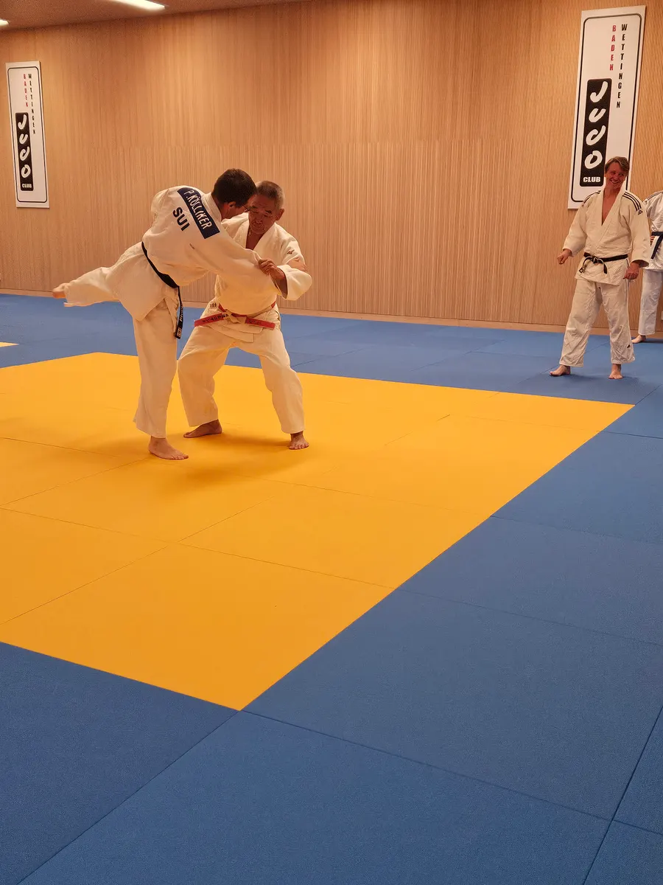

## Technischer Kurs mit Hiroshi Katanishi: Bewegen wie ein Judoka

Am Samstag, 19. September 2026, lud der Aargauer Judo und Ju-Jitsu Verband (AJV) von 9.00 bis 12.30 Uhr zum technischen Judokurs mit Maître Hiroshi Katanishi, 8. Dan Judo, ins Dojo des Judo Club Baden-Wettingen. Der Kurs stand allen Judokas ab Jahrgang 2011 aus den Vereinen und Schulen des AJV offen, war für AJV-Mitglieder kostenlos und wird im Judopass eingetragen.

Das Thema lautete «Sich bewegen wie ein Judoka» – eine Grundlage, die in jeder Technik steckt und doch oft zu wenig Beachtung findet.

## Von Tsugi-ashi bis zum normalen Schritt

Ausgangspunkt war Tsugi-ashi, der Nachstellschritt, bei dem die Füsse sich nie kreuzen. Danach ging es weiter zum normalen Schritt (Ayumi-ashi) – und das in alle Richtungen: vorwärts, rückwärts, seitwärts und diagonal. Katanishi Sensei achtete dabei auf jedes noch so kleine Detail, von der Position der Füsse über die Gewichtsverlagerung bis zur Haltung des ganzen Körpers.

Zusätzlich baute Hiroshi Katanishi diverse Rhythmikübungen ein, die alle Teilnehmenden ordentlich forderten: Schrittfolgen im wechselnden Takt verlangten Konzentration, Koordination und ein gutes Gefühl für den eigenen Körper.

## Von der Bewegung zum Kuzushi

Aus der Fussarbeit heraus führte der Kurs schliesslich zum Kuzushi, dem Gleichgewichtsbruch. Im Zusammenspiel mit einem Partner zeigte sich schnell, wie viel eine saubere Bewegung ausmacht: Wer sich richtig bewegt, bleibt selbst im Gleichgewicht und kann den Partner leichter aus dem Gleichgewicht bringen – die Grundlage für jede erfolgreiche Wurftechnik.

## Herzlichen Dank

Ein grosses Dankeschön an Hiroshi Katanishi für den lehrreichen Kurs, an Matthias Marti für die Organisation, an den Judo Club Baden-Wettingen für die Gastfreundschaft und an alle Teilnehmenden für ihren Einsatz auf der Matte.
